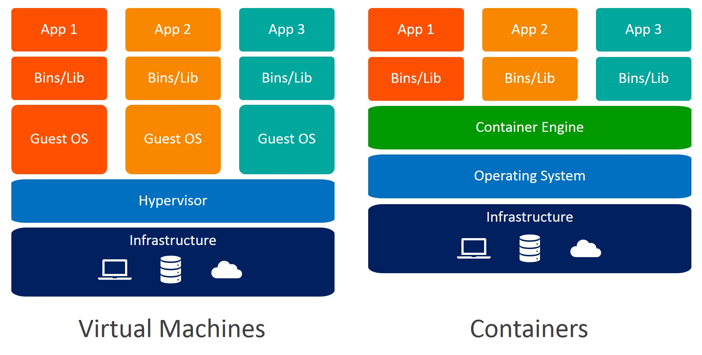

# docker_valaxy
how to use docker and deploy

# Why k8's

* scalability
* version control
* visibility

# Why Docker ?

* previously to deploy the application in servers that are in data center like they show in movies you need need network,routers,volumes... 

* If you want to update a new version you need new infra setup and if the userers are increase the infra also need to keep up which piles up the cost

* so to comeup with a soln virtulizations came
    * with one server we can create multiple servers that utilize the cpu efficiently 
    * for eg you server has 24gb ram and 4 ghz cpu we can create 4 vm's with 6gb ram and 1Ghs CPU

* THEN came CLOUD where you pay-as-go and can reserve resources   

 

## Now lets discus y?

* Lets say you want to deploy a app like java or python that uses springboot or djanjo frame work that need library dependecies and os level depencencies

* Now we can have ready made image with all the depencies installed and ready to test

* microleythic service where a macro serive is divided to muliple services, like for eg tahe unber app we have multiple services uber go, uber auto can run independtly with out breaking the complete app if any particular services

 

